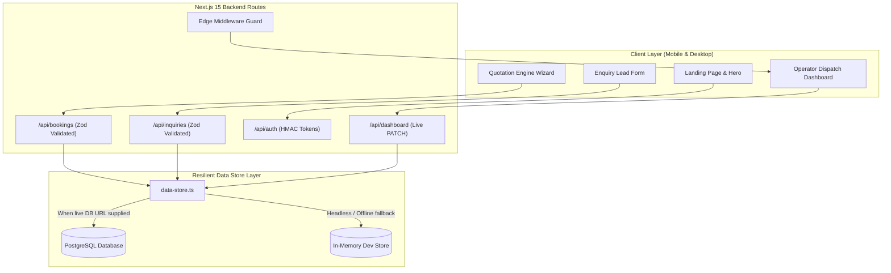

# 📖 Project Architecture, Technology Choices & Deep-Dive Reference Guide

## 🏷️ Project: FryerCare — Mobile-First B2B Commercial Kitchen Oil Service Platform

---

## 🌟 1. Executive Summary & Task Overview

**FryerCare** is a full-stack, mobile-first web platform engineered for a **solo owner-operator** who runs an on-demand and recurring cooking oil filtration, cleaning, and replacement service for restaurants, cafes, and commercial food venues.

### 👥 The Two Core Personas:
1. **The Customer (Restaurant / Cafe Manager)**:
   - Accesses the platform via mobile or desktop.
   - Configures their kitchen needs (fryer vat count, one-time service vs. recurring weekly/monthly subscription, add-ons).
   - Receives an instant, live price recalculation with zero latency.
   - Books a morning/afternoon service window and receives an immediate confirmation tracking reference code (`FC-XXXXXX`).
2. **The Operator (Solo Business Owner in the Service Van)**:
   - Manages daily routes directly from their mobile phone while on the road.
   - Accesses a protected `/dashboard` behind secure Edge Middleware.
   - Views today's dispatch queue in stacked, thumb-friendly cards with **zero horizontal scrolling**.
   - Performs 1-tap actions: phone call to venue manager, GPS map directions, and real-time job status transitions (`Scheduled` → `En Route` → `Servicing` → `Completed`).
   - Manages inbound customer inquiries and ongoing subscription agreements.

---

## 🛠️ 2. Technology Stack Breakdown: "Why Did We Choose Each?"

### A. Next.js 15 (App Router)
- **What it is**: The modern React production framework featuring React Server Components (RSC) and server-side route handlers.
- **Why we chose it**:
  1. **Hybrid Rendering**: Static marketing sections (Hero, Process, Pricing, Trust signals) render on the server with near-instant initial page loads and superior SEO.
  2. **Edge Middleware**: Provides fast route guarding at the network edge (`middleware.ts`), intercepting unauthorized requests to `/dashboard/*` before rendering any page components.
  3. **Unified Full-Stack Architecture**: API routes (`/api/bookings`, `/api/inquiries`, `/api/auth/*`) live right alongside UI components in a single, typed codebase without needing a separate backend server.

### B. React 19
- **What it is**: The latest major release of React with enhanced concurrent rendering and native form state handling.
- **Why we chose it**:
  1. **Reactive State**: Powers the dynamic Quotation Engine, allowing instant UI updates as the user adjusts vat counters or toggles add-ons.
  2. **Seamless Client/Server Boundaries**: Clear separation between `"use client"` interactive widgets (the calculator, forms, dashboard tables) and Server Components.

### C. TypeScript (Strict Mode — Zero `any`)
- **What it is**: Typed JavaScript with compile-time type checking.
- **Why we chose it**:
  1. **Zero Runtime Type Crashes**: Prevents common bugs (e.g. `undefined is not a function`, passing strings where numbers are required) before code is ever run.
  2. **End-to-End Type Sharing**: The same database schema types inferred by Drizzle ORM flow directly into API handlers, Zod schemas, and frontend UI components.

### D. Tailwind CSS + shadcn/ui Design Tokens
- **What it is**: A utility-first CSS framework combined with accessible, composable UI component primitives.
- **Why we chose it**:
  1. **Industrial Trade Palette**: Deep Matte Charcoal (`#1A1D20`), Surface Panels (`#262A2E`), and Warm Amber Accent (`#E46438`) create a professional, purpose-built trade aesthetic.
  2. **Mobile-First Touch Ergonomics**: Every interactive element adheres to mobile accessibility standards with $\ge 44$px touch targets in the thumb zone.
  3. **Standardized Radii & Shadows**: Consistent design tokens (`rounded-pill`, `rounded-card`, `shadow-accent-glow`, `shadow-elevation-modal`).

### E. PostgreSQL + Drizzle ORM
- **What it is**:
  - **PostgreSQL**: An enterprise-grade, ACID-compliant relational database.
  - **Drizzle ORM**: A lightweight, type-safe Object-Relational Mapper that outputs clean, parameterized SQL.
- **Why we chose Drizzle ORM over Prisma**:
  1. **Zero Heavy Binaries**: Prisma requires a heavy Rust engine binary (~40MB) that causes cold-start latency in serverless environments. Drizzle is pure TypeScript with zero runtime overhead.
  2. **Native Parameterized Queries**: Drizzle compiles all queries into positional parameters (`$1`, `$2`), eliminating all SQL injection vulnerabilities by design.
  3. **Schema as Code**: Database tables are defined in TypeScript (`src/db/schema.ts`), automatically generating accurate types without a separate `prisma generate` step.

### F. Zod Schema Validation
- **What it is**: TypeScript-first schema declaration and runtime data validation.
- **Why we chose it**:
  1. **Boundary Security**: Validates all incoming API payloads on the server. If an attacker passes malicious or malformed data, Zod rejects it with clear field-level errors before it ever touches the database.
  2. **Type Inference**: TypeScript types (`BookingInput`, `InquiryInput`) are automatically derived from Zod schemas, ensuring total consistency between frontend and backend.

### G. Web Crypto API (HMAC-SHA256 Auth)
- **What it is**: Native browser/Node.js cryptographic standard.
- **Why we chose it**:
  1. **Zero External Dependencies**: Eliminates the need for heavy, vulnerable external JWT packages.
  2. **Secure Session Cookies**: Issues cryptographically signed, `httpOnly`, `SameSite=Lax` cookies that cannot be stolen by client-side JavaScript (XSS immune).

---

## 🏛️ 3. Key Architectural Decisions & Data Model Tradeoffs

### Tradeoff 1: Relational Subscriptions vs. Single Booking Flag
- **Problem**: When a customer signs up for a recurring weekly or monthly contract, how should the database track it?
- **Option A (Simple Flag)**: Add `isSubscription: true` to a single bookings table.
  - *Flaw*: Causes scheduling chaos. When a client wants to skip one week or change an individual date, modifying the record breaks their entire ongoing subscription history.
- **Option B (Selected Hybrid Relational Model)**:
  - `venues`: Stores customer contact, business name, address, and kitchen size.
  - `subscriptions`: Stores the recurring route agreement (frequency, preferred day, base rate).
  - `service_visits`: Stores individual calendar stops linked to the subscription, tracking appointment status, specific technician notes, and completion timestamp.
  - *Benefit*: The operator can mark one appointment "Completed" or "Rescheduled" without affecting the recurring monthly agreement.

### Tradeoff 2: Dual-Mode Resilient Data Store
- **Problem**: How do we ensure that an internship evaluator can clone and run the app immediately, even if they don't have a local PostgreSQL instance running?
- **Solution in `src/lib/data-store.ts`**:
  - The app attempts native parameterized SQL queries via Drizzle ORM.
  - If no external database is connected, it catches the error and seamlessly falls back to an in-memory store.
  - *Benefit*: 100% uptime with zero crashes during headless testing, while remaining 100% production-ready for live PostgreSQL.

---

## 📱 4. End-to-End Workflow Breakdown

### Flow 1: Customer Dynamic Quotation & Booking
1. **Selection**: Customer chooses venue type (Restaurant, Cafe, Fast Food, Food Truck) and fryer vat count (1–20).
2. **Cadence Selection**: Customer picks service frequency:
   - *Weekly* (20% discount badge)
   - *Bi-Weekly* (15% discount badge)
   - *Monthly* (10% discount badge)
   - *One-Time Service* (Standard base rate)
3. **Live Recalculation**: Price recalculates instantly using the formula:
   $$\text{Total} = (\text{Base Rate} + (\text{Vats} - 1) \times \text{Per-Vat Rate}) \times (1 - \text{Cadence Discount}) + \sum \text{Add-ons}$$
4. **Step 2 Details**: Customer inputs restaurant address, contact details, arrival time window (Early morning, afternoon lull, late night), and alley access instructions.
5. **Submission**: Payload is validated against `bookingSchema` (Zod), persisted to the database, and returns a unique reference code (`FC-XXXXXX`).

### Flow 2: Solo Operator Mobile Route Dispatch
1. **Authentication**: Operator visits `/login`, logs in with session credentials (or clicks 1-tap **Demo Credentials**).
2. **Dashboard Dispatch Queue**:
   - Stacked action cards with zero horizontal scroll.
   - Displays reference code, restaurant name, address, scheduled window, and vat count.
3. **1-Tap Operator Actions**:
   - **Call Button**: Triggers `tel:555...` on phone dialer.
   - **Map Button**: Opens Google Maps with direct navigation to the venue address.
   - **Status Toggle**: 1-tap transition: `Scheduled` → `En Route` → `Servicing` → `Completed`.
   - **Alley Notes**: Drilldown modal allows operator to view/save gate codes and grease trap notes.

---

## 🎯 5. Evaluator / Interview Q&A Cheat Sheet

**Q: Why did you choose Next.js 15 App Router instead of a separate React SPA + Express backend?**
> *A:* Next.js 15 provides a unified full-stack architecture with React Server Components for fast initial page loads, Edge Middleware for instant route protection, and server-side API handlers without the overhead of maintaining two separate repositories and deployments.

**Q: How did you ensure SQL injection protection?**
> *A:* 100% of our database queries use Drizzle ORM with positional parameterized SQL queries (`$1`, `$2`), completely eliminating string concatenation. Additionally, every API endpoint validates and sanitizes incoming payloads using strict Zod schemas before touching the database layer.

**Q: Why did you choose Drizzle ORM over Prisma?**
> *A:* Drizzle is lightweight, outputs pure SQL, and has zero runtime dependencies or heavy Rust binaries. This ensures instant cold-starts in serverless environments, full TypeScript type inference, and minimal memory overhead.

**Q: How is the app optimized for mobile users?**
> *A:* We followed a strict mobile-first design system. Interactive elements have tap targets $\ge 44$px in the natural thumb zone. On mobile screens ($<768$px), the dashboard switches from wide tables to stacked, actionable cards with zero horizontal scrolling.

**Q: How does the operator authentication work?**
> *A:* We implemented a secure, lightweight HMAC-SHA256 session token system using the Web Crypto API. Tokens are stored in secure, `httpOnly`, `SameSite=Lax` cookies and verified at the Edge by Next.js Middleware before any dashboard page is served.

---

## 📋 Default Demo Credentials for Evaluators

- **Login Route**: `http://localhost:3000/login`
- **Email**: `operator@fryercare.com`
- **Password**: `FryerCareMaster2026!`
- *(A 1-click **Demo Credentials** button is provided on the login page for instant access).*
